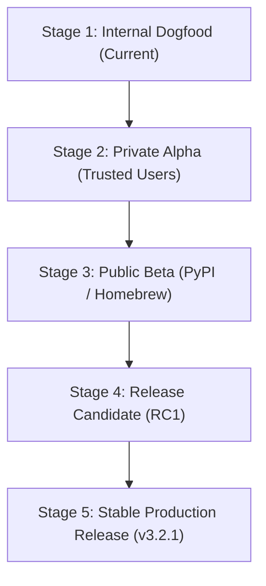

# Staged Public Launch Plan — Nexus CLI

This document outlines the rollout strategy, staging phases, operational gates, and rollback triggers for launching Nexus CLI `3.2.1`.

---

## 1. Staged Rollout Phases

### Stage 1 — Internal Dogfooding (Completed)
- Founder and core contributor repositories.
- Full local diagnostic logging active.
- Rapid patch application.

### Stage 2 — Private Alpha (Target: Immediate Post-Approval)
- Selected partner developers and trusted internal teams.
- Qualification of diverse local models (Ollama, llama.cpp) and cloud providers.
- Feedback collection on CLI UX and error messages.

### Stage 3 — Public Beta (Target: Next 14 Days)
- Public PyPI release (`pip install nexusai-cli`).
- Experimental features (e.g. autonomous deployment) disabled by default.
- Automated GitHub issue templates for crash reporting.

### Stage 4 — Release Candidate (Target: Next 30 Days)
- Complete feature freeze.
- Final soak testing across multi-platform CI matrix (Linux, macOS, Windows).
- Security audit re-verification.

### Stage 5 — Stable Production Release
- Official v3.2.1 release tag and stable PyPI release.
- Production support and SLA monitoring active.

---

## 2. Automatic Rollback Triggers

Emergency release rollback will be executed immediately if:
1. Any false `VERIFIED` outcome is reported in production use.
2. Any secret leakage incident or unredacted credential exfiltration occurs.
3. Unhandled repository corruption occurs during execution.
4. Clean installation fails on a supported python runtime (`>=3.10`).
