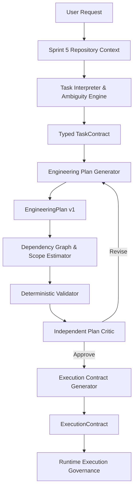

# SPRINT 6 PLANNING ARCHITECTURE

## 1. End-to-End Pipeline Architecture

## 2. Planning Subsystem Modules (`nexus/planning/`)

1. `task_contract.py`: TaskContract, Requirement provenance, Constraint, TaskType classification.
2. `ambiguity.py`: Blocking vs Non-blocking ambiguity detection, repository-resolvable question filter.
3. `engineering_plan.py`: EngineeringPlan, PlanStep, Hypothesis tracking, adaptive granularity.
4. `acceptance.py`: AcceptanceCriterion engine mapping requirements to executable commands/tests.
5. `validator.py`: Deterministic plan validator checking bounds, snapshots, dependency loops.
6. `graph.py`: Step dependency graph, topological ordering, parallelization safety.
7. `scope.py`: MutationScope blast-radius estimator using Sprint 5 repository graph.
8. `risk.py`: RiskLevel assessment (LOW, MEDIUM, HIGH, CRITICAL).
9. `cost.py`: Token, cost, and latency estimation interface.
10. `critic.py`: Independent PlanCritic challenging assumptions, scope, missing callers/tests.
11. `execution_contract.py`: ExecutionContract runtime enforcer.
12. `replanner.py`: Versioned replanning (v1, v2) with loop prevention.
13. `policies.py`: Task-class templates (bug repair, feature, refactor, migration, security, dependency upgrade).
14. `engine.py`: Canonical PlanningEngine facade.
